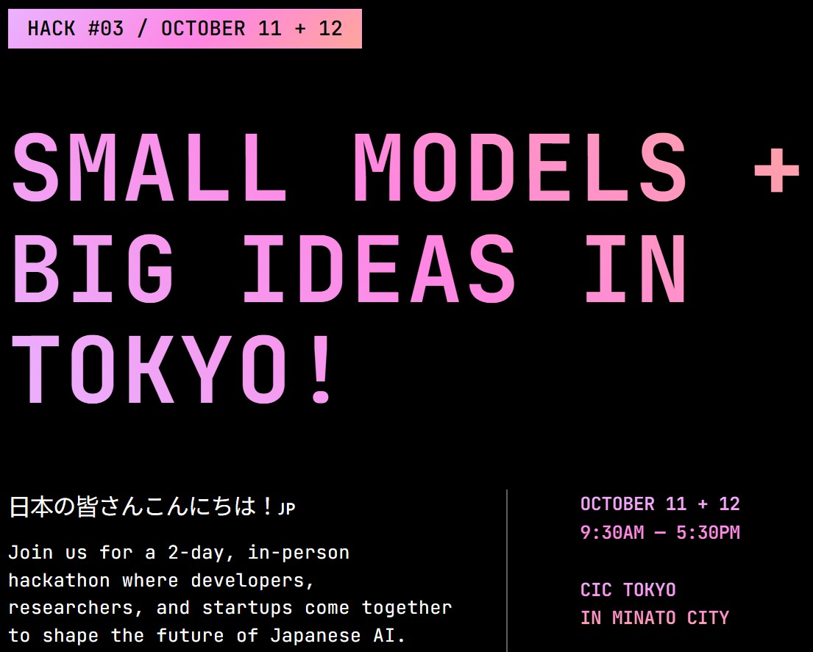

# 🚴‍♂️ AI Cycling Companion — Liquid AI Hackathon Project (2nd Place 🥈)



<p align="center">
  <b>🏆 2nd Place</b> — <a href="https://hackathons.liquid.ai/">Liquid AI x W&B x Lambda Hackathon Tokyo</a>  
</p>

<p align="center">
  
  
  
  
  
</p>

---

## 🌟 Overview

This project was built for the [**Liquid AI x W&B x Lambda Hackathon**](https://hackathons.liquid.ai/) in Tokyo 🇯🇵,  
where our team proudly won **2nd place** 🥈 for our creative concept.

**Idea:**  
A **local AI cycling companion** that speaks Japanese naturally while you ride —  
like a friendly character from _Cars_ or _Thomas the Tank Engine_.  
It’s designed to make cycling more emotional, conversational, and fun 🚲💬

---

## 💡 Concept Flow

- 🎙️ Record short voice clips via the mobile app
- 🧩 Transcribe audio (Whisper / ASR)
- 🐍 Send text to a FastAPI backend connected to **LFM2-VL** (Japanese multimodal LLM)
- 🤖 Model replies in natural Japanese
- 🔊 Response is spoken aloud — creating a real-time “AI riding buddy”

---

## 🧰 Tech Stack

| Layer              | Description                                                                                                            |
| ------------------ | ---------------------------------------------------------------------------------------------------------------------- |
| **Frontend**       | [Expo (React Native)](https://expo.dev/) — voice capture & UI                                                          |
| **Backend**        | [FastAPI](https://fastapi.tiangolo.com/) — transcription + model bridge                                                |
| **Model**          | [LFM2-VL](https://huggingface.co/HayatoHongo/lfm2-vl-ja-finetuned-enmt1ep-jamt10eponall-vqa) — multimodal Japanese LLM |
| **Infra**          | [Lambda Cloud](https://cloud.lambda.ai/) — training and fine-tuning                                                    |
| **Tracking**       | [Weights & Biases](https://wandb.ai/) — experiments and evaluation                                                     |
| **Language Focus** | 🇯🇵 Japanese — for natural, culture-aware interactions                                                                  |

---

## 🧩 Architecture Overview


---

## 🏆 Recognition

This project stood out for its **creativity** and **human-centered design** —
bringing together Japanese culture, empathy, and conversational AI.

> “It feels like riding with a character who actually understands you.”

---

## 🙏 Acknowledgements

Huge thanks to everyone who made this project possible:

- [**Liquid AI Tokyo**](https://hackathons.liquid.ai/) — Hackathon organizers
- [**Lambda Cloud**](https://cloud.lambda.ai/) — Model training environment
- [**Weights & Biases (W&B)**](https://wandb.ai/) — Experiment tracking tools
- **[@Hayato Hongo](https://huggingface.co/HayatoHongo)** — LFM2-VL model author & fine-tuning
- **[@Rikka Botan](https://huggingface.co/RikkaBotan)** — Model deployment and integration

---

## 📘 Related Links

- [Event Guide (Notion)](https://www.notion.so/Liquid-AI-x-W-B-x-Lambda-Hackathon-Event-Guide-285cbef042ad8042b2aec6952082fde4?pvs=21)
- [Liquid AI Hugging Face Models](https://huggingface.co/LiquidAI/collections)
- [Hayato Hongo LFM2-VL Repo](https://github.com/HayatoHongo/LFM2-VL-450M-JA-Instruct-MAIN)
- [Rikka Botan GGUF Model](https://huggingface.co/RikkaBotan/lfm2-vl-ja-finetuned-enmt1ep-jamt10eponall-vqa_GGUF)

---

## 🚀 Future Work

- Real-time conversation & latency optimization
- Add emotional tone and “ride personality”
- Expand to regional Japanese dialects (関西弁, 東北弁, etc.)

---

### 🇯🇵 Built in Tokyo — where empathy meets innovation.

> **“Vibe coding meets human connection.”**

---

## 概要（日本語）

このプロジェクトは、Liquid AI × W&B × Lambda Hackathon Tokyo 🥈 で 2 位を受賞した「AI 自転車コンパニオン」アプリです。  
React Native（Expo）で開発されたモバイルアプリと、FastAPI サーバー上で動作する日本語マルチモーダルモデル（LFM2-VL）を組み合わせ、  
ユーザーが自転車に乗りながら自然な日本語で会話できる体験を実現しました。

日本の「共感」と「創造性」を活かした、人間中心の AI インタラクションを目指しています。  
開発・運用には Hugging Face, Lambda Cloud, Weights & Biases を使用しました。

```

```
