# 🚴‍♂️ AI Bicycle Companion — Mobile App (Expo / React Native)

This repository contains the **mobile client** of the _AI Bicycle Companion_ — an interactive Japanese-speaking assistant designed for hands-free conversations while cycling.
Developed during the [Liquid AI x W&B x Lambda Hackathon (Tokyo, 2025)](https://hackathons.liquid.ai/), where the project won **2nd Place** 🥈.

---

## 📱 Overview

The mobile app acts as the **front-end interface** between the user, the voice system, and the AI model served via a local **FastAPI backend**.
It handles:

- 🎙️ **Speech recording** (10-second voice snippets)
- 🔊 **Speech-to-text (Whisper API or local mock)**
- 🤖 **LLM interaction** (via HTTP call to Python server)
- 🗣️ **Text-to-speech output** using Expo Speech API

The architecture prioritizes **lightweight communication**, **fast feedback**, and **hands-free usage** suitable for real-world cycling.

## 

## ⚙️ Tech Stack

| Layer                 | Technology                                            |
| --------------------- | ----------------------------------------------------- |
| Framework             | [Expo SDK 51+](https://docs.expo.dev/) / React Native |
| Audio & TTS           | `expo-av`, `expo-speech`                              |
| File Handling         | `expo-file-system`, `expo-permissions`                |
| HTTP Client           | Native `fetch` (with FormData for audio)              |
| Environment Variables | `dotenv` + `expo-constants`                           |
| Development Tools     | Android Studio (emulator) or Expo Go (mobile)         |

---

## 🧠 Data Flow

```mermaid
sequenceDiagram
    participant U as User
    participant A as Expo App
    participant W as Whisper API (STT)
    participant S as FastAPI Server (LFM Model)

    U->>A: Tap “Record” button
    A->>A: Record audio (10 sec) with `expo-av`
    A->>W: Send audio → Whisper API (Speech-to-Text)
    W-->>A: Return transcription (Japanese text)
    A->>S: Send JSON {text, metadata} to FastAPI
    S-->>A: Return model response (comment / dialogue)
    A->>A: Display + play response using `expo-speech`
    A->>U: 🔊 Spoken output
```



---

## 📂 Project Structure

```
/app
 ├── index.tsx                  # Main screen / UI
 ├── utils/
 │    ├── recordAudio.ts        # Start / stop / save recording
 │    ├── transcribeAudio.ts    # Send audio to Whisper API
 │    └── sendToModelServer.ts  # Communicate with FastAPI backend
 ├── components/
 │    └── MicButton.tsx         # Reusable record button
 ├── assets/                    # Static assets (icons, sounds)
.env                            # API keys (Hugging Face / Local server)
app.json                        # Expo configuration (permissions, extras)
package.json
```

---

## 🔐 Environment Setup

Create a `.env` file at the root:

```bash
HUGGINGFACE_API_URL=https://api-inference.huggingface.co/models/your-whisper-model
FASTAPI_SERVER_URL=http://10.0.0.XX:8000  # Replace with your LAN IP
OPENAI_API_KEY=sk-xxxxxx
```

Make sure to reference these in code:

```tsx
import Constants from "expo-constants";
const API_URL = Constants.expoConfig?.extra?.FASTAPI_SERVER_URL;
```

---

## 🧩 Permissions (Expo)

Update `app.config.ts`:

```json
{
   "name": "AI Bicycle Companion",
   "slug": "ai-bike-companion",
   "permissions": ["AUDIO_RECORDING"],
   "plugins": [
      "expo-router",
      [
        "expo-camera",
        {
          "cameraPermission": "Allow $(PRODUCT_NAME) to access your camera",
          "microphonePermission": "Allow $(PRODUCT_NAME) to access your microphone",
          "recordAudioAndroid": true
        }
      ],
      [
        "expo-audio",
        {
          "microphonePermission": "Allow $(PRODUCT_NAME) to access your microphone."
        }
      ],
   "extra": {
        "FASTAPI_SERVER_URL": process.env.FASTAPI_SERVER_URL,
      "OPENAI_API_KEY": process.env.OPENAI_API_KEY,
      "WHISPER_API_URL": process.env.WHISPER_API_URL,
      "HUGGINGFACE_API_URL": process.env.HUGGINGFACE_API_URL,
      "HUGGINGFACE_API_KEY": process.env.HUGGINGFACE_API_KEY
    },
}
```

---

## 🚀 Run Locally

```bash
# Install dependencies
npm install

# Start Expo
npm run start

# Launch Android emulator or scan QR in Expo Go
```

If your FastAPI server runs locally, ensure your **phone and PC are on the same network**
and use your **local IP** (not `127.0.0.1`) for API calls.

---

## 🧠 Model Interaction

The app sends requests like:

```ts
const formData = new FormData();
formData.append("file", audioFile);
formData.append("question", "今の風景についてどう思う？");
formData.append("max_new_tokens", "128");

const response = await fetch(`${API_URL}/generate`, {
	method: "POST",
	body: formData,
});
```

Response (example):

```json
{
	"prompt": "今の風景についてどう思う？",
	"generated_text": "いい天気ですね、まるで旅の始まりのようです。"
}
```

---

## 🧩 Troubleshooting

| Issue                    | Cause                  | Solution                                                     |
| ------------------------ | ---------------------- | ------------------------------------------------------------ |
| `Network request failed` | Wrong local IP         | Replace `127.0.0.1` with LAN IP                              |
| `device offline (adb)`   | Emulator not connected | Restart Android Studio & run `adb reverse tcp:8000 tcp:8000` |
| Audio not recorded       | Missing permission     | Check Expo `app.json` for `"AUDIO_RECORDING"`                |
| `.env` values undefined  | Not loaded in Expo     | Add them to `app.config.ts > extra`                          |

---

## 🏁 Next Steps

- Add **real-time streaming transcription (Whisper WebSocket)**
- Integrate **LFM2-VL vision model** for camera-based commentary
- Deploy backend to **Lambda Cloud** or **Vercel Edge Functions**

---

## 🏆 Acknowledgements

This mobile app was developed as part of the
[Liquid AI x W&B x Lambda Hackathon (Tokyo)](https://hackathons.liquid.ai/) —
earning **2nd place** for creativity and human-centered AI design.

Special thanks to:

- **Hayato Hongo** — [LFM2-VL fine-tuning expert](https://huggingface.co/HayatoHongo)
- **Rikka Botan** — [Model optimization and deployment](https://huggingface.co/RikkaBotan)
