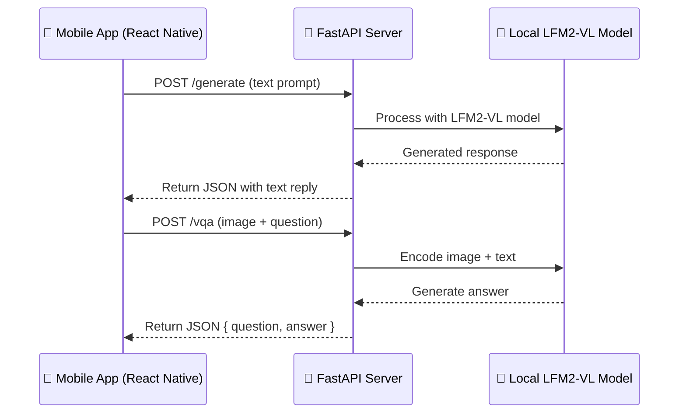

# 🧠 AI Bicycle Companion — FastAPI Server

This repository contains the **FastAPI backend** used in the _AI Bicycle Companion_ project — an interactive mobile app developed during the [Liquid AI x W&B x Lambda Hackathon (Tokyo, 2025)](https://hackathons.liquid.ai/), where it won 🥈 **2nd Place** for creativity and human-centered AI.

The server provides a lightweight **API layer** for model inference, connecting the mobile app (built with Expo/React Native) to a **multimodal language model** capable of understanding both **text** and **images**.

---

## ⚙️ Overview

This FastAPI app (`API.py`) runs locally and exposes two main endpoints:

| Route       | Method | Description                                                |
| ----------- | ------ | ---------------------------------------------------------- |
| `/generate` | `POST` | Generate text from a user prompt                           |
| `/vqa`      | `POST` | Visual Question Answering — takes an image + text question |

Both endpoints use the [**LFM2-VL Japanese Finetuned Model**](https://huggingface.co/HayatoHongo/lfm2-vl-ja-finetuned-enmt1ep-jamt10eponall-vqa), a multimodal large language model trained for Japanese vision-language understanding.

---

## 🧩 Tech Stack

| Component        | Technology                                                                    |
| ---------------- | ----------------------------------------------------------------------------- |
| Framework        | [FastAPI](https://fastapi.tiangolo.com/)                                      |
| Model            | [Transformers (Hugging Face)](https://huggingface.co/docs/transformers/index) |
| Image Processing | Pillow (`PIL`)                                                                |
| Inference        | `torch`                                                                       |
| Model            | `HayatoHongo/lfm2-vl-ja-finetuned-enmt1ep-jamt10eponall-vqa`                  |

---

## 🗂️ File Structure

```
/server
 ├── API.py          # FastAPI server file
 ├── requirements.txt
 └── README.md
```

---

## 📦 Installation & Setup

```bash
# 1. Clone the repository
git clone https://github.com/<your_username>/<your_repo>.git
cd <your_repo>/server

# 2. Create a virtual environment
python -m venv venv
source venv/bin/activate     # (on Windows: venv\Scripts\activate)

# 3. Install dependencies
pip install -r requirements.txt

# 4. Run the FastAPI server
uvicorn API:app --host 0.0.0.0 --port 8000 --reload
```

The server will be available at
👉 **[http://localhost:8000](http://localhost:8000)**

---

## 🧪 API Endpoints

### 🔤 `/generate` — Text Generation

**Request (JSON):**

```json
{
	"prompt": "今日の天気はどうですか？",
	"max_new_tokens": 200,
	"temperature": 0.7
}
```

**Response:**

```json
{
	"prompt": "今日の天気はどうですか？",
	"generated_text": "今日は晴れで、自転車には最高の日です！"
}
```

---

### 🖼️ `/vqa` — Visual Question Answering

**Request (FormData):**

```
file: <image file>
question: この写真について教えてください
max_new_tokens: 200
```

**Example cURL:**

```bash
curl -X POST "http://localhost:8000/vqa" \
  -F "file=@bicycle.jpg" \
  -F "question=この写真について教えてください" \
  -F "max_new_tokens=200"
```

**Response:**

```json
{
	"question": "この写真について教えてください",
	"answer": "青い自転車が道路の横に止まっています。"
}
```

---

## ⚙️ Model Details

The model is automatically downloaded via `transformers`:

```python
MODEL_PATH = "HayatoHongo/lfm2-vl-ja-finetuned-enmt1ep-jamt10eponall-vqa"
```

It uses:

- `AutoProcessor` for text/image preprocessing
- `AutoModelForImageTextToText` for multimodal generation
- `torch.device("auto")` for GPU/CPU handling

No environment variables or external APIs are required —
all inference runs **locally** once the model is cached by Hugging Face.

---

## 🧠 Example Workflow



---

## 🔍 Example Usage in React Native

```javascript
const response = await fetch("http://<YOUR_LOCAL_IP>:8000/generate", {
	method: "POST",
	headers: { "Content-Type": "application/json" },
	body: JSON.stringify({
		prompt: transcriptionText,
		max_new_tokens: 256,
		temperature: 0.3,
	}),
});
const result = await response.json();
console.log(result.generated_text);
```

---

## 🧰 Troubleshooting

| Issue                        | Cause              | Solution                                                |
| ---------------------------- | ------------------ | ------------------------------------------------------- |
| `ModuleNotFoundError: 'API'` | Wrong filename     | Ensure file is named `API.py` and run `uvicorn API:app` |
| `torch not found`            | Missing dependency | Run `pip install torch`                                 |
| Model download too slow      | Large checkpoint   | Preload the model via `transformers-cli`                |
| Network error on mobile      | Wrong IP           | Use your **local IPv4** instead of `localhost`          |

---

## 🧱 Requirements

```
fastapi
uvicorn
torch
transformers
Pillow
```

---

## 🏆 Credits

Developed by

- **[@Leo-Paul MARTIN](https://github.com/leopaul29)** (Mobile & Server Integration)
- **[@Hayato Hongo](https://huggingface.co/HayatoHongo)** (Model training & tuning)
- **[@Rikka Botan](https://huggingface.co/RikkaBotan)** (Model quantization and GGUF version)

For the **[Liquid AI x W&B x Lambda Hackathon (Tokyo 2025)](https://hackathons.liquid.ai/)**
→ _2nd Place – Human-Centered AI Design_

---

## 🇯🇵 Future Work

- Add speech-to-text pre-processing (Whisper)
- Add streaming inference for real-time chat
- Dockerize for deployment
- Extend to multimodal conversation memory
